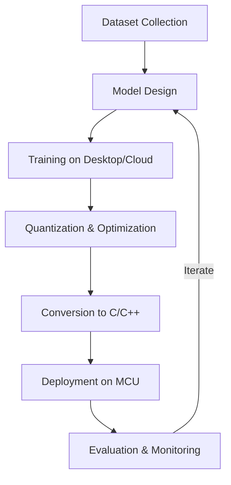

+++
title = "TinyML: AI at the Edge"
date = 2023-04-14T18:28:00+01:00
draft = false
tags = ["tinyml", "ai", "edge-computing", "embedded-systems"]
categories = ["deep learning"]
# Opzionale:
mermaid = true  # Per includere diagrammi
katex = true    # Per formule matematiche
+++

# TinyML: Bringing AI to the World's Smallest Devices

TinyML (Tiny Machine Learning) represents a groundbreaking field at the intersection of embedded systems and machine learning. It focuses on deploying ML algorithms on ultra-low-power microcontrollers and embedded devices, often operating with just milliwatts or microwatts of power.

## Why TinyML Matters

The ability to run ML models directly on edge devices without cloud connectivity offers several advantages:

- **Privacy**: Data remains on the device
- **Latency**: Immediate responses without network delays
- **Efficiency**: Reduced power consumption
- **Reliability**: Functions without internet connectivity
- **Cost**: Eliminates cloud computing expenses

## Technical Challenges

Implementing neural networks on devices with as little as 256KB of flash memory and 64KB of RAM presents significant challenges. Consider the memory requirements of a typical CNN:

$$\text{Memory Footprint} = \sum_{l=1}^{L} (I_l + O_l + W_l + B_l)$$

Where:
- $I_l$ is the input tensor size for layer $l$
- $O_l$ is the output tensor size for layer $l$
- $W_l$ is the weights size for layer $l$
- $B_l$ is the bias size for layer $l$

For example, a simple convolutional layer with 16 3×3 filters processing a 28×28 image with 8-bit quantization requires:

$$\text{Memory} = (28 \times 28 \times 1) + (26 \times 26 \times 16) + (3 \times 3 \times 1 \times 16) + 16 = 12,272 \text{ bytes}$$

## Model Optimization Techniques

TinyML relies on several optimization strategies:

1. **Quantization**: Reducing precision from float32 to int8 or even binary
2. **Pruning**: Removing unnecessary connections
3. **Knowledge Distillation**: Training smaller networks to mimic larger ones
4. **Neural Architecture Search**: Automatically finding efficient architectures
5. **Compiler Optimizations**: Generating optimized code for specific microcontrollers

## TinyML Development Workflow



## Code Example: Audio Keyword Classification with TensorFlow Lite

Here's a simplified implementation of an audio keyword spotter using TensorFlow Lite for Microcontrollers:

```cpp
#include "tensorflow/lite/micro/all_ops_resolver.h"
#include "tensorflow/lite/micro/micro_error_reporter.h"
#include "tensorflow/lite/micro/micro_interpreter.h"
#include "tensorflow/lite/schema/schema_generated.h"
#include "model.h"  // The converted model in a C array

// Globals for TFLite Micro
constexpr int kTensorArenaSize = 30 * 1024;
uint8_t tensor_arena[kTensorArenaSize];

void setup() {
  // Set up logging
  static tflite::MicroErrorReporter micro_error_reporter;
  tflite::ErrorReporter* error_reporter = &micro_error_reporter;
  
  // Map the model into a usable data structure
  const tflite::Model* model = tflite::GetModel(g_model);
  
  // Create an interpreter to run the model
  static tflite::AllOpsResolver resolver;
  static tflite::MicroInterpreter interpreter(
      model, resolver, tensor_arena, kTensorArenaSize, error_reporter);
  
  // Allocate memory for the model's input/output tensors
  interpreter.AllocateTensors();
  
  // Get pointers to the model's input and output tensors
  TfLiteTensor* input = interpreter.input(0);
  TfLiteTensor* output = interpreter.output(0);
}

void loop() {
  // Capture audio and extract MFCC features
  // ...
  
  // Run inference
  interpreter.Invoke();
  
  // Process results
  // ...
}
```

## Real-World Applications

TinyML is already transforming various industries:

1. **Predictive Maintenance**: Detecting machine anomalies using vibration sensors
2. **Agriculture**: Smart irrigation and crop monitoring with minimal infrastructure
3. **Healthcare**: Continuous monitoring of vital signs with battery-operated wearables
4. **Smart Homes**: Voice interfaces and presence detection with extreme privacy
5. **Environmental Monitoring**: Wildlife tracking and conservation efforts in remote areas

## Future Directions

The field of TinyML is rapidly evolving with innovations in:

- **Hardware acceleration**: Specialized neural processing units for MCUs
- **Training algorithms**: On-device training and adaptation
- **Federated learning**: Collaborative model improvement without data sharing
- **Neuromorphic computing**: Brain-inspired architectures for extreme efficiency

## Conclusion

TinyML represents a paradigm shift in how we deploy AI, moving from cloud-centric approaches to truly distributed intelligence at the edge. As devices become more capable while maintaining tiny power budgets, we'll see intelligence embedded in everyday objects around us, fundamentally changing how we interact with technology.

## Further Resources

- [TinyML Foundation](https://www.tinyml.org/)
- [TensorFlow Lite for Microcontrollers](https://www.tensorflow.org/lite/microcontrollers)
- [Edge Impulse](https://www.edgeimpulse.com/)
- [Arduino Machine Learning](https://docs.arduino.cc/library-examples/machine-learning-examples/)
- [Harvard's TinyML Course](https://www.edx.org/learn/machine-learning/harvard-university-tiny-machine-learning)
